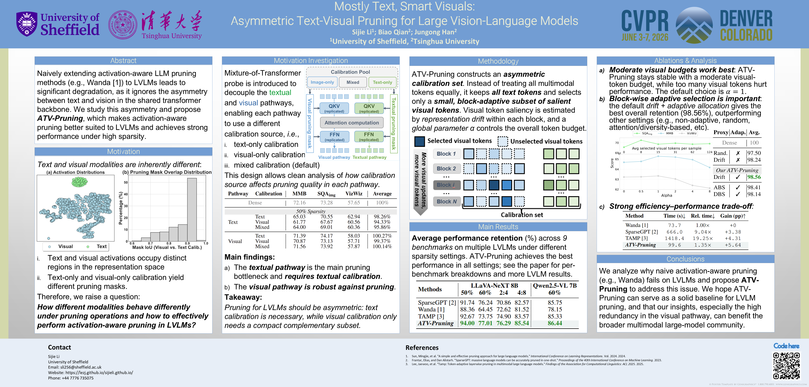

# ATV-Pruning
[CVPR 2026] Mostly Text, Smart Visuals: Asymmetric Text-Visual Pruning for Large Vision-Language Models



---

### Supported models

* **Qwen VL (2 & 2.5):** Full pruning and evaluation code is available in `./qwen`.
* **LLaVA (NeXT & OneVision):** 
  * **Setup:** Our primary experiments are based on LLaVA-NeXT using the [TAMP](https://github.com/G-JWLee/TAMP) codebase.
  * **Replication:** You can replicate our results by porting our codes in `./qwen/activation_aware_pruner.py` into the TAMP environment.
  * **Note:** For fairness, we only evaluate and compare under the *uniform-sparsity* pruning condition.

### Data preparation
We use **ShareGPT4V** for calibration. Since ShareGPT4V is included in the LLaVA-NeXT visual instruction tuning dataset, you can obtain it by downloading the full LLaVA-NeXT data:

1. Download [LLaVA-NeXT-Data](https://huggingface.co/datasets/lmms-lab/LLaVA-NeXT-Data) from Hugging Face.
2. Store the dataset at: `your_directory/LLaVA-NeXT-Data`.

### Run Qwen VL experiments

#### Environment setup
Create a Conda environment:

```bash
conda create --name atv_pruning python=3.10
conda activate atv-pruning
```
We use `torch==2.6.0` with CUDA `12.4`. Please install your corresponding version first.

Then install the remaining dependencies:
```bash
pip install torch==2.6.0 torchvision==0.21.0 torchaudio==2.6.0 --index-url https://download.pytorch.org/whl/cu124
pip install -r requirements.txt
```

#### Run pruning
Run the following script:
```bash
bash qwen\prune.sh
```

#### Run evaluation
We use [lmms-eval](https://huggingface.co/datasets/lmms-lab/LLaVA-NeXT-Data) for evaluation. Please install it following the official documentation. Version `0.4.0` has been tested and should work.

Then run:
```bash
bash qwen\eval.sh
```

### Citation

If you find our work helpful, please cite our paper:

```bibtex
@article{li2026mostly,
  title={Mostly Text, Smart Visuals: Asymmetric Text-Visual Pruning for Large Vision-Language Models},
  author={Li, Sijie and Qian, Biao and Han, Jungong},
  journal={arXiv preprint arXiv:2603.16001},
  year={2026}
}
```

### Acknowledgements

We sincerely thank the authors of [SparseGPT](https://github.com/IST-DASLab/sparsegpt), [Wanda](https://github.com/locuslab/wanda), and [TAMP](https://github.com/G-JWLee/TAMP) for open-sourcing their codebases, upon which our work is built.